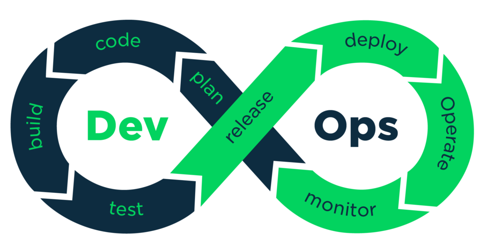
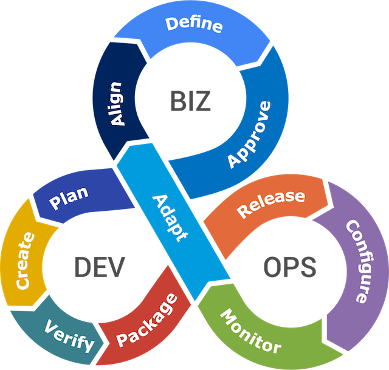
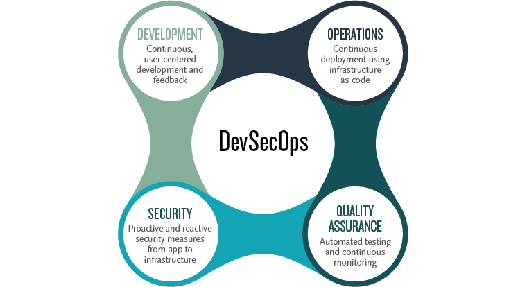
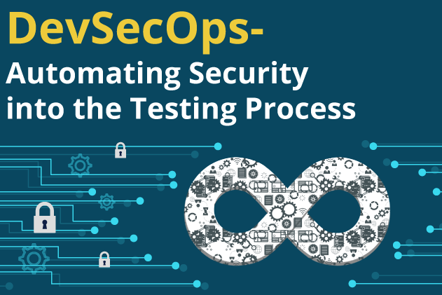
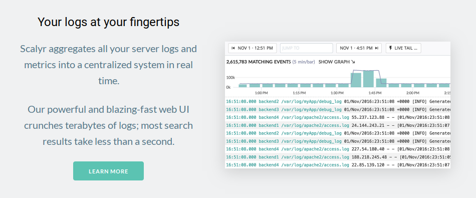

#  Docker Enterprise Edition v2 Demo and DevOps Showcase

This installation guide last updated at: **2018-12-13**

Ubuntu Version: **18.04**

Docker Enterprise Edition Version: **18.09**

## Overview

 
<!--  -->
 
<!--  -->
 
<!--  -->
 
<!--  -->

This demo and showcase consists of:

- Platform
  - **Ubuntu Linux**
  - **Docker Enterprise Edition**
    - Applications
      1. **Jenkins Continuous Integration Server**
      2. **SonarQube Code Quality Server**
      3. **Metrics and Events - TICK Stack**
        - InfluxDB
        - Telegraf
        - Chronograf
        - Kapacitor
      4. **Demo Web App**
        - ExpressJS app (Nodejs)
      5. **Blockchain Decentralized ID (DID) Authentication Demo**
        - KoaJS app (Nodejs)
      6. **Centralized logging**
        - Cloud service Scalyr.com
- Compliance as Code
  - **Inspec framework** for testing and auditing:
    1. Applications
    2. Infrastructure

## Prerequisites

1. [VirtualBox](https://www.virtualbox.org/wiki/Downloads)
2. [Vagrant](https://www.vagrantup.com/)
3. From the Prerequisties [described here](https://docs.docker.com/engine/installation/linux/docker-ee/ubuntu/) begin with getting the Docker EE URL.
  - It will look like: *https://storebits.docker.com/ee/ubuntu/sub-xxxxx-xxxxx-xxxxx-xxxx-xxxxx-xxxx*

## Installation

- [Install Docker Enterprise Edition](install_docker.md)
- [Install Docker Trusted Registry](install_dtr.md)
- [Install Docker HTTP routing mesh](install_ucp_interlock.md)
- [Install Centralized Logging](install_centralized_logging.md)
- [Install Continuous Integration Server](install_continuous_integration_server.md)
- [Install Continuous Code Quality Server](install_continuous_code_quality.md)
- [Install Continuous Integration Jobs](install_continuous_integration_jobs.md)
- [Install Application Monitoring](install_monitoring.md)

## Applications

There is a growing list of Viseo demo applications for use in Docker Enterprise Edition.

Each application has setup and deployment instructions for local and prod.

You can choose from any or all of these:

- [Simple Web App](https://github.com/viseo-asia/demo-web-app)
- [Authenticate with Civic on the Blockchain](https://github.com/viseo-asia/blockchain-civic-demo)
- [Example of Microservice App (including: .Net, JavaScript, Go, Java, Python, PHP)](https://github.com/viseo-asia/docker-demo-multi-tech-pets-store)

## Compliance and Auditing

- [Install Inspec and execute tests](compliance/README.md)

## Appendix

1. Tick Stack Complete

2. Scalyr.com

