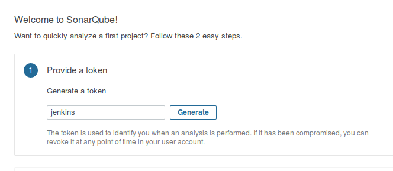
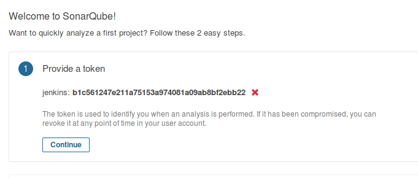
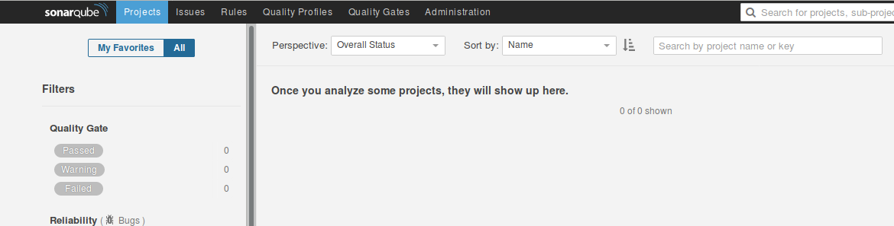
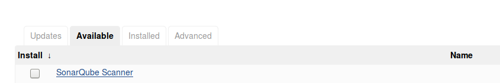
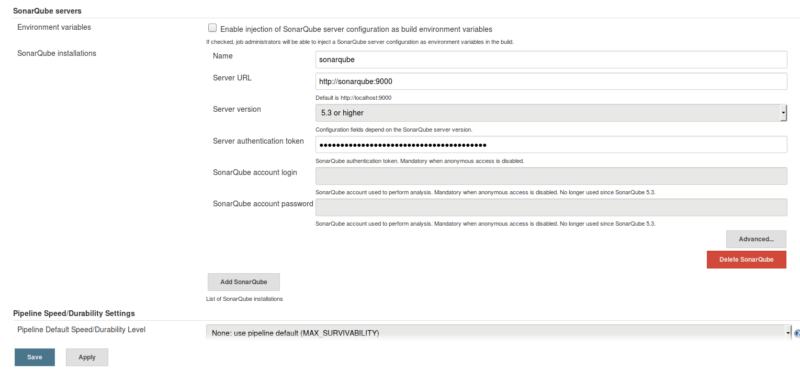
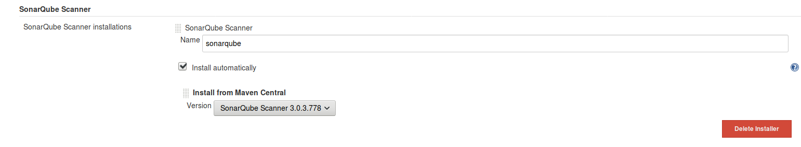
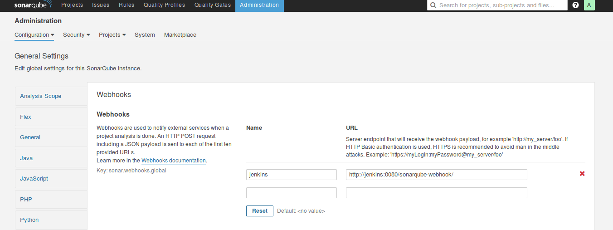
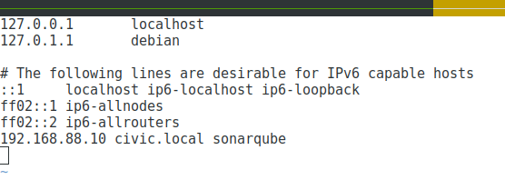
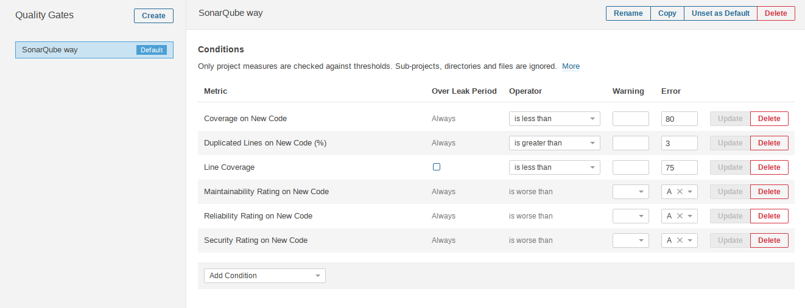

## Setup Sonarqube - Continuous Code Quality

The CI/CD process will include a Code Quality Gate: [Sonarqube](https://www.sonarqube.org/)

## Initial Configure SonarQube

By default you can login as `admin` with password `admin` at [http://192.168.88.10:9000/](http://192.168.88.10:9000/)

One first login we need to create a token which we'll use in Jenkins.

**Generate a Token for Jenkins to use**

You can use any name, but a good one is `jenkins` for the **Generate Token** input

One:

Two:

**Copy the token, we'll use it for Jenkins configuration**

Click continue, then skip tutorial, should be at an empty dashboard.

## Configure Jenkins

**Add the Sonarqube Plugin**

**Configure the Sonarqube plugin**

Jenkins > Manage Jenkins > Configure System >

- Name: sonarqube
- Server URL: http://sonarqube:9000
- Server Authentication Token: <TOKEN_FROM_SONARQUBE_INSTALL_STEP>

Jenkins > Manage Jenkins > Global Tool Configuration >

## Complete SonarQube Configuration

**Add a web-hook for Jenkins**

Configure a webhook in your SonarQube server pointing to `http://jenkins:8080/sonarqube-webhook/` (The trailing slash is mandatory)

Click >> Administration >> Webhooks

**Install and/or Update required Plugins**

Open up the plugins page at [http://192.168.88.10:9000/admin/marketplace](http://192.168.88.10:9000/admin/marketplace)

You should see you're using the *Community Edition*

Install or Upgrade the plugins:

1. SonarJS
2. Git

Don't forget to click *restart* at the top of the plugins page.

It's also useful to click through on reports, so add *sonarqube* to /etc/hosts on your laptop (host machine)

**Add a Quality Gate rule that we can use to toggle Pass or Fail when building**

Note the rule **Line Coverage** is the one we add. 

We can change the Error value to higher or lower than 75, for example, to make the Quality Gate Pass or Fail.

Sonarqube is very powerful, this is just out of the box defaults.

Explore it more at the Docs [https://docs.sonarqube.org/](https://docs.sonarqube.org/)

