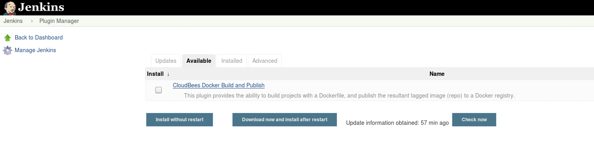
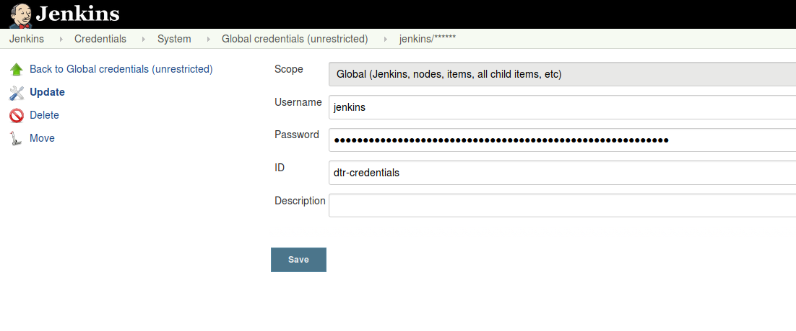

## Setup Continous Integration - Jobs

## Jenkins Plugins

1. Add plugin `CloudBees Docker Build and Publish` plugin

2. Create Jenkins user credentials for the Docker Truested Registry
    - On the Jenkins front page, click on Credentials -> System -> Global credentials -> Add Credentials
3. Use the ID `dtr-credentials` with user/pass *jenkins/password*

## Jobs

See the list of **Applications** to choose from.