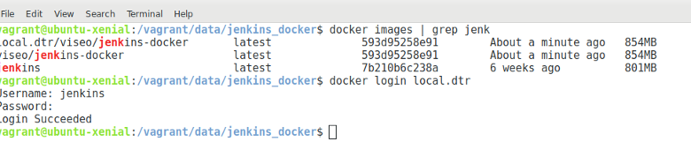

## Setup Continous Integration - Jenkins

Build a custom Jenkins image that can use the host Docker engine to build images.

1. `cd /vagrant/data/jenkins_docker/`
2. `docker build -t viseo/jenkins-docker .`
3. `docker tag viseo/jenkins-docker local.dtr/viseo/jenkins-docker`
4. `docker login local.dtr`

5. user/password is *jenkins/password*
6. `docker push local.dtr/viseo/jenkins-docker`

7. `cd /vagrant/data`
8. `docker stack deploy --compose-file docker-compose-ci.yml ci`

9. Open Jenkins admin: [http://192.168.88.10:8080](http://192.168.88.10:8080)
10. Follow the setup instructions, open a console in the Jenkins container and get the initial admin password:
11. `cat jenkins_home/secrets/initialAdminPassword`
12. Follow the Jenkins Install Wizard: **Install Suggested Plugins**
13. This will take a few minutes to install default suggested plugins

Installing...

14. Click **Continue as admin** - for this local env we won't create any other users for now

Continue as admin...

Click >> Start using Jenkins...

15. For this local env, we'll remove security (no login). Alternatively keep or reset the admin password.
16. In the *jenkins_home/* dir edit *config.xml*
17. Change *&lt;useSecurity&gt;true&lt;/useSecurity&gt;* to 
*&lt;useSecurity&gt;false&lt;/useSecurity&gt;* 
18. Restart the container
19. Open Jenkins admin: [http://192.168.88.10:8080](http://192.168.88.10:8080)

<!--
## Deploy a custom/specific image to a service

1. `docker service update --image 192.168.88.10:5000/demo-app:1.0.0 demo_web`

## Deploy Service Manually

1. `docker stack deploy --compose-file docker-compose.yml demo`

## Build Demo Web App (Local)

1. `cd /vagrant/data/app`
2. `docker build -t demo-app:1.0.0 .`
3. `docker run -it --rm --name demo-app --network host demo-app:1.0.0`
4. `curl 192.168.88.10:3000`
//5. `docker tag demo-app:1.0.0 192.168.88.10:5000/demo-app:1.0.0`
//6. `docker push 192.168.88.10:5000/demo-app:1.0.0`
-->
