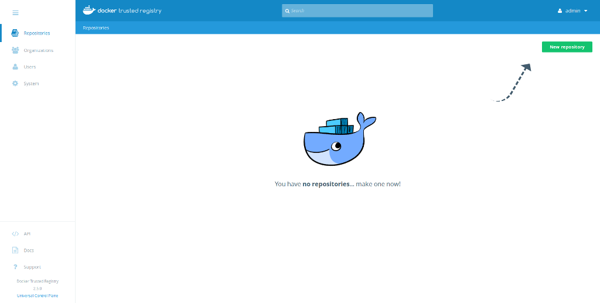
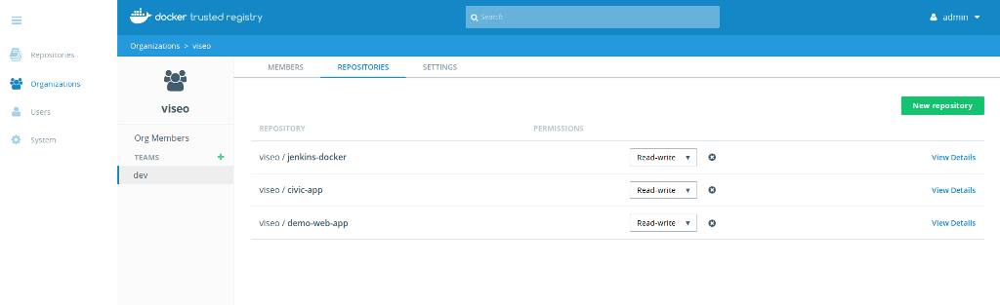

## Install Docker Trusted Registry

In this demo we are installing the DTR on the same virtual machine as the UCP control plane UI.


So we'll change the UCP UI to use port 444 and allow the DTR to use port 443.

1. Open [https://192.168.88.10/manage/settings/clusterconfig](https://192.168.88.10/manage/settings/clusterconfig) and change *Controller Port* to **444**
2. Click *Save*
3. Open [https://192.168.88.10:444/login/](https://192.168.88.10:444/login/)
4. Open [https://192.168.88.10:444/manage/settings/dtr](https://192.168.88.10:444/manage/settings/dtr)
  - Select the *UCP NODE* *ubuntu xenial*
  - Check *Disable TLS verification for UCP*
  - Copy to Clipboard
  - Execute
  - Add the flag `--ucp-password password` or input the admin passowrd *password* (local default we're using)

Example:

```
docker run -it --rm docker/dtr install \
--ucp-node ubuntu-xenial  \
--ucp-username admin  \
--ucp-password password \
--ucp-url https://192.168.88.10:444  \
--ucp-insecure-tls
```

Setup will take a few minutes, once the command line prompt returns you can check by reloading [https://192.168.88.10:444/manage/settings/dtr](https://192.168.88.10:444/manage/settings/dtr)

You should see *Installed DTRs: 192.168.88.10*

Open the DTR admin here: [https://192.168.88.10](https://192.168.88.10) then login as user *admin*



## Organization and Repository Setup

For our CI/CD and projects next is to setup our organization and repositories.

In the DTR admin UI:

1. Click *Organizations* > *New Organization* > *Organization Name* > **viseo** > *Save*
2. Click *Organizations* > *viseo* >  *Add user* > *New* > Username **jenkins** > Password **password** > *Save*
3. Click *Organizations* > *viseo* > *Repositories* > *Add repository* > *Repository Name* > **jenkins-docker** > *Save*
4. Click *Organizations* > *viseo* > *Repositories* > *Add repository* > *Repository Name* > **civic-app** > *Save*
5. Click *Organizations* > *viseo* > *Repositories* > *Add repository* > *Repository Name* > **demo-web-app** > *Save*
6. Click *Organizations* > *viseo* > *Teams +* > *Team Name* > **dev** > *Save*
7. Click *Organizations* > *viseo* > *Teams* > *dev* > *Add User* > *Existing* > **jenkins**
8. Click *Organizations* > *viseo* > *Teams* > *dev* > *Repositories* > *Existing* > **jenkins-docker** (read/write) > *Save*
9. Click *Organizations* > *viseo* > *Teams* > *dev* > *Repositories* > *Existing* > **civic-app** (read/write) > *Save*
10. Click *Organizations* > *viseo* > *Teams* > *dev* > *Repositories* > *Existing* > **demo-web-app** (read/write) > *Save*



## Local DNS resolution

1. Update `/etc/hosts`
2. `sudo vi /etc/hosts`
3. Add the entry:
4. `192.168.88.10 local.dtr`

## Domains and Proxies config

1. Open [https://192.168.88.10/system/settings/general](https://192.168.88.10/system/settings/general)
2. *Domains & Proxies* > *Load Balancer/Public Address* > **local.dtr**
3. *Save*

## Commandline access setup

1. Download the DTR CA certificate
  - `sudo curl -k https://local.dtr/ca -o /usr/local/share/ca-certificates/local.dtr`
2. Refresh the list of certificates to trust
  - `sudo update-ca-certificates`
3. Restart the Docker daemon
  - `sudo service docker restart`
