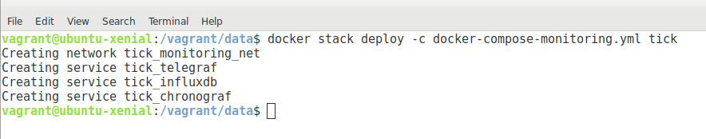

## Application Monitoring with the TICK stack

- `cd /vagrant/data`
- `docker stack deploy -c docker-compose-monitoring.yml tick`

## Testing

- `echo 'foo:1|c' | nc -w 1 -u telegraf 8125`

## Notes

https://medium.com/@jcbaey/your-nodejs-app-deserves-grafana-influxdb-and-statsd-f61d506bdb7e
