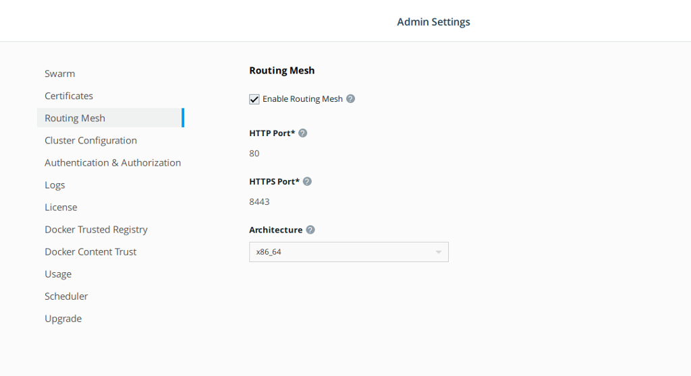

## Enable the HTTP routing mesh

So we can use domain names, example: http://civic.local, enable UCP HRM. 

Open [https://192.168.88.10:444/manage/settings/interlock](https://192.168.88.10:444/manage/settings/interlock)

## Update your workstation/laptop /etc/hosts

Add the entry in /etc/hosts

`192.168.88.10 civic.local`

Later once the demo web applications are running we'll use http://civic.local in the browser.

